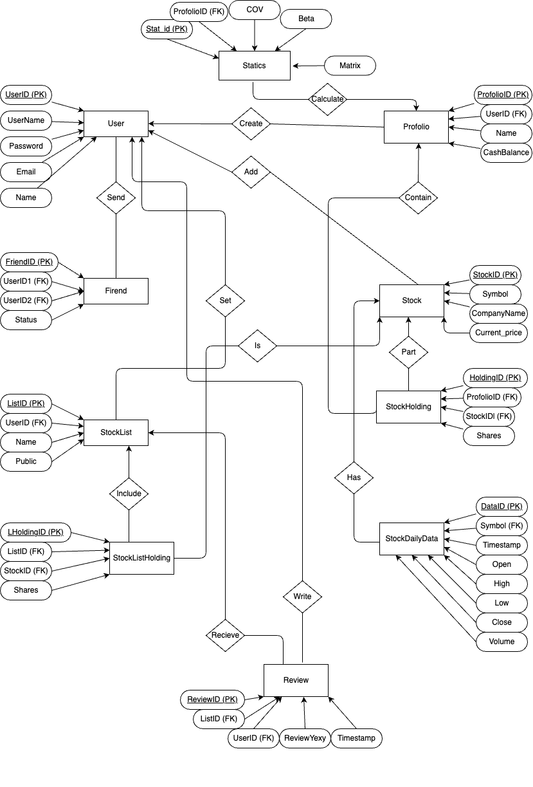

### Entity-Relationship Diagram (ERD):
Here is the proposed Entity-Relationship Diagram based on the provided relational schema:

- **User** (<u>UserID</u>, Username, Password, Email, Name)
- **Portfolio** (<u>PortfolioID</u>, Name, CashBalance)
- **Stock** (<u>StockID</u>, Symbol, CompanyName)
- **StockHolding** (<u>HoldingID</u>, Shares)
- **StockDailyData** (<u>DataID</u>, Timestamp, Open, High, Low, Close, Volume)
- **Friend** (<u>FriendID</u>, Status)
- **StockList** (<u>ListID</u>, Name, Public)
- **StockListHolding** (<u>LHoldingID</u>, Shares)
- **Review** (<u>ReviewID</u>, ReviewText, Timestamp)
- **Statics** (<u>Stat_id</u>, COV, Beta, Matrix)

### Normalization Steps:

1. **First Normal Form (1NF):**
    - Ensure that each attribute contains only atomic values.
    - Eliminate repeating groups or arrays.
    
2. **Second Normal Form (2NF):**
    - Meet the requirements of 1NF.
    - Remove partial dependencies.
    
3. **Third Normal Form (3NF):**
    - Meet the requirements of 2NF.
    - Eliminate transitive dependencies.

### Normalized Tables:

1. **User** (<u>UserID</u>, Username, Password, Email, Name)
2. **Portfolio** (<u>PortfolioID</u>, Name, CashBalance)
3. **Statics** (<u>Stat_id</u>, COV, Beta, Matrix)
4. **Stock** (<u>StockID</u>, Symbol, CompanyName)
5. **StockHolding** (<u>HoldingID</u>, Shares)
6. **StockDailyData** (<u>DataID</u>, Timestamp, Open, High, Low, Close, Volume)
7. **Friend** (<u>FriendID</u>, Status)
8. **StockList** (<u>ListID</u>, Name, Public)
9. **StockListHolding** (<u>LHoldingID</u>, Shares)
10. **Review** (<u>ReviewID</u>, ReviewText, Timestamp)
11. **Create** (<u>UserID</u>, <u>PortfolioID</u>)
12. **Add** (<u>UserID</u>, <u>StockID</u>)
13. **Send** (<u>UserID</u>, <u>FriendID</u>)
14. **Set** (<u>UserID</u>, <u>ListID</u>)
15. **Include** (<u>ListID</u>, <u>LHoldingID</u>)
16. **Is** (<u>StockID</u>, <u>ListID</u>)
17. **Contain** (<u>PortfolioID</u>, <u>HoldingID</u>)
18. **Part** (<u>StockID</u>, <u>HoldingID</u>)
19. **Has** (<u>Symbol</u>, <u>DataID</u>)
20. **Write** (<u>UserID</u>, <u>ReviewID</u>)
21. **Recieve** (<u>ListID</u>, <u>ReviewID</u>)
22. **Calculate** (<u>Stat_id</u>, <u>PortfolioID</u>)

